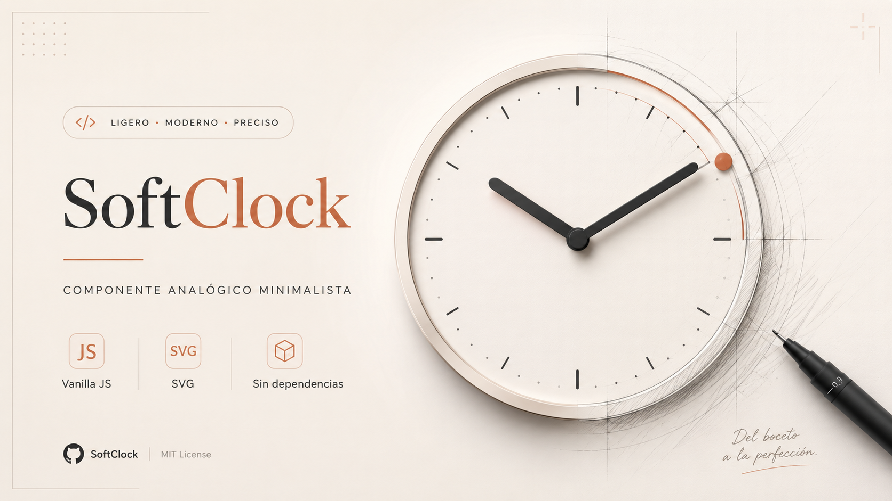

# SoftClock

**Reloj analógico encapsulado en un único archivo de JavaScript.** Geometría suave, cuatro temas incluidos, paletas aleatorias coherentes y una sola dependencia: el navegador.

Sin frameworks. Sin build. Sin CSS externo. Cae en cualquier proyecto — HTML estático, WordPress, React, Vue, Astro, Eleventy — añadiendo una etiqueta `<script>`.

---



## Tabla de contenidos

1. [Visión general](#visión-general)
2. [Características](#características)
3. [Instalación](#instalación)
4. [Uso rápido](#uso-rápido)
5. [Opciones de configuración](#opciones-de-configuración)
6. [Atributos `data-*` (modo declarativo)](#atributos-data--modo-declarativo)
7. [API pública](#api-pública)
8. [Temas incluidos](#temas-incluidos)
9. [Personalización avanzada](#personalización-avanzada)
10. [Accesibilidad](#accesibilidad)
11. [Rendimiento](#rendimiento)
12. [Encapsulación y aislamiento](#encapsulación-y-aislamiento)
13. [Compatibilidad](#compatibilidad)
14. [Recetas](#recetas)
15. [Preguntas frecuentes](#preguntas-frecuentes)
16. [Estructura del archivo](#estructura-del-archivo)
17. [Cambios de comportamiento sutiles](#cambios-de-comportamiento-sutiles)
18. [Licencia y créditos](#licencia-y-créditos)

---

## Visión general

SoftClock es un componente visual: un reloj analógico SVG con estética geométrica suave y minimalista. La pieza distintiva es que **no tiene aguja de segundos**. En su lugar, un punto orbital recorre el perímetro dejando un arco de color que se va completando con cada minuto. Es el único elemento de acento del reloj: todo lo demás es geometría neutra (puntos, líneas redondeadas, anillo fino).

El componente se distribuye como un único archivo (`softclock.js`, ~22 KB sin minificar) y no requiere instalación, configuración ni hojas de estilo adicionales.

### Cuándo usar SoftClock

- Páginas de aterrizaje o portafolios donde un reloj funciona como guiño visual.
- Dashboards y paneles internos que necesitan mostrar la hora con estilo.
- Plantillas comerciales (Themeforest, marketplaces) que quieren un toque distintivo sin sumar dependencias.
- Sitios con varios usos del reloj en distintas zonas y distintos temas.

### Cuándo no es la mejor opción

- Aplicaciones que necesitan precisión sub-segundo o sincronización NTP — SoftClock usa la hora local del navegador.
- Relojes editables (cronómetros, temporizadores, cuentas atrás). SoftClock muestra la hora actual y no expone API para fijar una hora arbitraria.

---

## Características

| Característica | Detalle |
|---|---|
| Tamaño | Un archivo, ~22 KB sin minificar, ~9 KB tras minify |
| Dependencias | Ninguna |
| Encapsulación | IIFE; sólo expone `window.SoftClock` |
| CSS | Autoinyectado una sola vez, prefijo `.sck-` |
| Render | SVG con `viewBox` fijo: escala sin pérdida |
| Animación | `requestAnimationFrame` único compartido entre instancias |
| Modo declarativo | Atributo `data-soft-clock` (cero JS de integración) |
| Modo programático | `SoftClock.mount()` con API completa |
| Temas | 4 incluidos + paletas personalizadas + generador aleatorio |
| Accesibilidad | `role="img"`, `aria-label` con hora legible, soporte `prefers-reduced-motion` |
| Múltiples instancias | Cada una con su propio tema y tamaño, un solo loop de animación |
| Limpieza | `destroy()` elimina nodos y se desregistra del loop |

---

## Instalación

### Opción A — Archivo local

Copia `softclock.js` al proyecto e inclúyelo:

```html
<script src="/path/to/softclock.js"></script>
```

### Opción B — Embebido en línea

Pega el contenido del archivo dentro de una etiqueta `<script>` directamente en el HTML. El componente sigue funcionando idénticamente.

### Opción C — Sistemas de módulos

SoftClock es un IIFE que asigna a `window.SoftClock`. Funciona en cualquier entorno con `window` disponible: bundlers (webpack, Vite, Rollup), CMS (WordPress), generadores estáticos (Eleventy, Astro), frameworks (React, Vue, Svelte).

> **Nota para React/Vue/Svelte:** ver la sección [Recetas](#integración-con-react) más adelante.

### Carga diferida

El archivo es seguro tanto en `<head>` con `defer` como al final del `<body>`. El bloque de auto-montaje detecta si el DOM está listo y, si no, espera a `DOMContentLoaded`.

---

## Uso rápido

### Modo declarativo (cero JavaScript)

```html
<div data-soft-clock></div>
<script src="softclock.js"></script>
```

Esto inyecta un reloj con el tema `porcelana` a 180 px. Para configurarlo, añade atributos `data-*`:

```html
<div data-soft-clock
     data-theme="grafito"
     data-size="240"
     data-sweep="true"
     data-seconds="true"></div>
```

### Modo programático

```html
<div id="miReloj"></div>

<script src="softclock.js"></script>
<script>
  const clock = SoftClock.mount('#miReloj', {
    theme:   'salvia',
    size:    220,
    sweep:   true,
    seconds: true,
  });
</script>
```

`SoftClock.mount()` devuelve una instancia con métodos para cambiar el tema, randomizarlo o destruirlo (ver [API pública](#api-pública)).

---

## Opciones de configuración

Las opciones aceptadas por `SoftClock.mount()`:

| Opción | Tipo | Por defecto | Descripción |
|---|---|---|---|
| `theme` | `string \| object` | `'porcelana'` | Nombre de un tema incluido o paleta personalizada. |
| `size` | `number` | `180` | Lado del reloj en píxeles. El SVG es cuadrado. |
| `sweep` | `boolean` | `true` | `true` → barrido continuo (animación suave). `false` → tic-tac discreto cada segundo. |
| `seconds` | `boolean` | `true` | `true` → muestra el punto orbital y el arco de segundos. `false` → reloj sólo con horas y minutos. |

> **Detalle:** si el sistema operativo del usuario tiene activado *prefers-reduced-motion*, la opción `sweep` se ignora y el reloj avanza siempre en pasos de un segundo, incluso si está configurada en `true`.

---

## Atributos `data-*` (modo declarativo)

| Atributo | Equivale a | Valores aceptados |
|---|---|---|
| `data-soft-clock` | (marca el elemento como reloj) | (presente / ausente) |
| `data-theme` | `theme` | `porcelana` \| `grafito` \| `salvia` \| `niebla` |
| `data-size` | `size` | Entero en píxeles, p. ej. `200` |
| `data-sweep` | `sweep` | `true` (por defecto) \| `false` |
| `data-seconds` | `seconds` | `true` (por defecto) \| `false` |

Cualquier `<div>` con `data-soft-clock` presente en el DOM al cargar la página se convierte automáticamente en reloj. El componente marca el contenedor con `data-sck-mounted="1"` para evitar montajes dobles si el script se incluye dos veces por error.

> **Aviso:** los relojes añadidos al DOM **después** de cargar el script no se montan automáticamente. Usa `SoftClock.mount()` para relojes dinámicos.

---

## API pública

Toda la API vive bajo `window.SoftClock`:

### `SoftClock.mount(target, options)`

Crea una instancia de reloj y la inyecta dentro de `target`.

**Parámetros:**

- `target` — selector CSS (`string`) o elemento del DOM (`HTMLElement`) donde insertar el reloj.
- `options` — objeto opcional con las claves descritas en [Opciones de configuración](#opciones-de-configuración).

**Devuelve:** una instancia (ver [Métodos de instancia](#métodos-de-instancia)) o `null` si el target no se encuentra.

```js
const clock = SoftClock.mount('#hero', { theme: 'grafito', size: 280 });
```

### `SoftClock.themes`

Array con los nombres de los temas incluidos:

```js
SoftClock.themes
// → ['porcelana', 'grafito', 'salvia', 'niebla']
```

Útil para construir selectores de tema dinámicamente.

### `SoftClock.version`

Versión actual del componente como cadena, p. ej. `'1.0.0'`.

---

### Métodos de instancia

Una instancia devuelta por `mount()` expone:

#### `instance.setTheme(theme)`

Cambia el tema en caliente. Acepta:

- **Nombre de tema incluido** (`string`): `'porcelana'`, `'grafito'`, `'salvia'`, `'niebla'`.
- **Paleta personalizada parcial u objeto completo** (ver [Personalización avanzada](#personalización-avanzada)).

```js
clock.setTheme('grafito');
clock.setTheme({ accent: '#FF5577' }); // sólo cambia el acento
```

La transición entre temas dura ~450 ms gracias a una transición CSS en el SVG.

**Devuelve:** la propia instancia (encadenable).

#### `instance.randomize()`

★ Hook de viralidad / shareability. Genera una paleta HSL coherente al vuelo: un tono base aleatorio, un acento complementario desplazado y luminosidades fijas que garantizan que las relaciones de contraste se mantengan siempre.

Cada llamada produce un reloj con un look nuevo pero "creíble" (ni quemado ni plano).

```js
clock.randomize();
```

**Devuelve:** la paleta generada como objeto, por si quieres guardarla o reproducirla:

```js
const palette = clock.randomize();
// → { face: 'hsl(214 28% 94%)', ring: 'hsl(214 24% 86%)', ... }
console.log(JSON.stringify(palette));
```

#### `instance.destroy()`

Elimina el reloj del DOM y lo desregistra del loop de animación compartido. Si era el último reloj de la página, el `requestAnimationFrame` se detiene por completo.

```js
clock.destroy();
```

Tras `destroy()`, la instancia no debe volver a usarse. Para un reloj nuevo en el mismo sitio, llama a `SoftClock.mount()` otra vez.

#### `instance.el`

Referencia al elemento raíz (`<div class="sck-root">`) por si necesitas medirlo, leer su `boundingClientRect`, añadirle clases extra, etc.

#### `instance.options`

El objeto de opciones tras fusionarlas con los valores por defecto. Sólo lectura conceptual — modificarlo no afecta al reloj en marcha.

---

## Temas incluidos

Las cuatro paletas se eligieron para cubrir contextos diversos sin solaparse: una clara cálida, una oscura, una verdosa orgánica y una azulada fría.

### `porcelana`

Crema cálido sobre blanco roto, acento terracota. Look editorial, encaja bien con tipografías serif y proyectos editoriales o de bienestar.

| Token | Color |
|---|---|
| `face` | `#F7F4EF` |
| `ring` | `#E6E1D8` |
| `mark` | `#C6BFB2` |
| `hand` | `#33302B` |
| `accent` | `#C2603F` |
| `shadow` | `rgba(80, 70, 55, .14)` |

### `grafito`

Carbón con marcas grisáceas, acento verde salvia tenue. Para fondos oscuros, dashboards y modos noche.

| Token | Color |
|---|---|
| `face` | `#24262C` |
| `ring` | `#33363F` |
| `mark` | `#565B68` |
| `hand` | `#E8EAEF` |
| `accent` | `#8FC0AC` |
| `shadow` | `rgba(10, 12, 18, .45)` |

### `salvia`

Verde pálido orgánico, acento ocre cálido. Marcas de bienestar, naturaleza, slow living.

| Token | Color |
|---|---|
| `face` | `#E8EEE5` |
| `ring` | `#D2DECE` |
| `mark` | `#9CB096` |
| `hand` | `#2F3B2E` |
| `accent` | `#C97B5A` |
| `shadow` | `rgba(60, 80, 58, .16)` |

### `niebla`

Azul humo desaturado, acento mostaza. Profesional, tech sutil, fintech amigable.

| Token | Color |
|---|---|
| `face` | `#EAEDF3` |
| `ring` | `#D9DEE9` |
| `mark` | `#ABB4C7` |
| `hand` | `#2E3445` |
| `accent` | `#DE9E4C` |
| `shadow` | `rgba(55, 65, 95, .16)` |

---

## Personalización avanzada

### Tokens del tema

Cada tema se compone de seis tokens:

| Token | Aplica a |
|---|---|
| `face` | Fondo de la esfera |
| `ring` | Anillo exterior fino |
| `mark` | Puntos y trazos de las marcas horarias |
| `hand` | Agujas de hora y minuto + disco del eje |
| `accent` | Punto orbital de segundos, arco del minuto y núcleo del eje |
| `shadow` | Sombra exterior difusa (cualquier valor válido para `drop-shadow()`) |

### Paleta personalizada completa

Pasa un objeto en lugar de un nombre:

```js
const clock = SoftClock.mount('#miReloj', {
  theme: {
    face:   '#F0E7DD',
    ring:   '#E0D2C0',
    mark:   '#B8A38C',
    hand:   '#3D2E20',
    accent: '#D94A2C',
    shadow: 'rgba(60, 30, 10, .18)',
  },
});
```

### Paleta parcial

`setTheme()` acepta objetos parciales: los tokens no incluidos conservan su valor actual.

```js
clock.setTheme('grafito');
clock.setTheme({ accent: '#FFD166' }); // grafito con acento ámbar
```

Esto es útil para "marcar" relojes con el color corporativo sin renunciar al resto del tema.

### Modificar mediante CSS

Como los colores son CSS custom properties en la raíz de la instancia, también puedes sobreescribirlos desde tu hoja de estilos:

```css
#hero .sck-root {
  --sck-accent: #FF3366;
}
```

Cualquier selector con suficiente especificidad funciona. Los nombres siguen el patrón `--sck-<token>`.

### Cambiar el tamaño después de montar

El reloj se ajusta a su contenedor: el SVG tiene `width: 100%; height: 100%` dentro de `.sck-root`. Para redimensionar en caliente, cambia el tamaño del propio `.sck-root`:

```js
clock.el.style.width  = '320px';
clock.el.style.height = '320px';
```

O, si prefieres dejar que el layout decida:

```css
.sck-root { width: 100%; height: 100%; }
```

---

## Accesibilidad

SoftClock se trata como un widget puramente visual con descripción accesible:

- El `<svg>` lleva `role="img"`.
- Lleva `aria-label` con la hora actual legible (formato local `HH:mm`), actualizada cada vez que cambia el minuto. Ejemplo: `"Reloj analógico: 14:32"`.
- Si el sistema del usuario indica `prefers-reduced-motion: reduce`, el barrido continuo (`sweep`) se desactiva automáticamente y el reloj avanza en pasos de un segundo, sin micro-animaciones.
- No hay sonidos. No hay parpadeos. No hay efectos que puedan disparar fotosensibilidad.

> **Limitación conocida:** SoftClock no expone la hora como texto seleccionable. Si necesitas que un lector de pantalla anuncie la hora cada cierto intervalo, complementa el reloj con un elemento con `aria-live="polite"` actualizado por tu propio código.

---

## Rendimiento

### Loop compartido

Todas las instancias de SoftClock en una página comparten **un único** `requestAnimationFrame`. El componente mantiene un registro interno de relojes vivos:

- Al montar el primer reloj, se inicia el rAF.
- Al montar relojes adicionales, simplemente se añaden al registro.
- Al llamar `destroy()`, el reloj se elimina del registro.
- Cuando no queda ningún reloj, el rAF se cancela por completo.

Esto significa que tener cinco o cincuenta relojes cuesta esencialmente lo mismo en términos de planificación de frames.

### Coste por frame

Cada frame, por cada reloj:

- 2 cálculos trigonométricos (`Math.cos`, `Math.sin`) para el punto orbital.
- 4 actualizaciones de atributos SVG (`transform`, `cx`, `cy`, `stroke-dasharray`).
- 1 comparación entera (¿cambió el minuto para actualizar el `aria-label`?).

No hay reflows, no hay layout thrashing. El SVG está fuera del flujo del documento, sus cambios sólo afectan a la capa de composición.

### Modo no-sweep

Configurando `sweep: false`, el reloj sigue funcionando con rAF pero las actualizaciones internas son escalonadas a un segundo. El rAF sigue activo (necesario para responder a cambios de tema), pero la diferencia visual es nula tras el primer segundo.

---

## Encapsulación y aislamiento

### Scope global

El componente se ejecuta dentro de un IIFE en modo estricto. La única referencia que añade a `window` es `SoftClock`. No hay variables sueltas, no hay polución de `globalThis`.

### CSS

Los estilos del componente se inyectan una sola vez al DOM, dentro de una etiqueta `<style id="sck-styles">`. Si el script se carga dos veces por error, la segunda vez detecta la presencia del id y no duplica nada.

Todas las clases CSS van prefijadas con `sck-` (`sck-root`, `sck-face`, `sck-hand`, etc.), lo que vuelve prácticamente imposible colisionar con tu hoja de estilos. Si quisieras, podrías añadir reset agresivos a `*` en tu CSS y SoftClock seguiría funcionando porque no hereda nada de su entorno.

### Múltiples instancias

Cada instancia es un `<div class="sck-root">` con sus propias CSS custom properties:

```html
<div class="sck-root" style="--sck-face: #24262C; --sck-accent: #8FC0AC; ...">
  <svg>...</svg>
</div>
```

Esto permite que dos relojes en la misma página tengan temas distintos sin tener que duplicar el bloque `<style>` ni recurrir a Shadow DOM.

---

## Compatibilidad

SoftClock funciona en navegadores modernos con soporte de:

- `requestAnimationFrame` (todos los navegadores actuales desde ~2012)
- SVG inline (universal)
- CSS Custom Properties (Chrome 49+, Firefox 31+, Safari 9.1+, Edge 15+)
- `Object.assign` (universal)
- Sintaxis ES6 mínima (arrow functions, `const`/`let`, template strings)

No soporta Internet Explorer 11 ni navegadores anteriores a 2016. Para compatibilidad con IE11 habría que transpilar y añadir polyfills para Custom Properties, lo cual queda fuera del alcance del componente.

---

## Recetas

### Múltiples relojes con temas diferentes

```html
<div data-soft-clock data-theme="porcelana" data-size="120"></div>
<div data-soft-clock data-theme="grafito"   data-size="120"></div>
<div data-soft-clock data-theme="salvia"    data-size="120"></div>
<div data-soft-clock data-theme="niebla"    data-size="120"></div>
<script src="softclock.js"></script>
```

Un solo `<script>`, cuatro relojes con cuatro temas. Comparten el loop de animación.

### Selector de tema dinámico

```html
<div id="reloj"></div>
<select id="picker">
  <option value="porcelana">Porcelana</option>
  <option value="grafito">Grafito</option>
  <option value="salvia">Salvia</option>
  <option value="niebla">Niebla</option>
</select>

<script src="softclock.js"></script>
<script>
  const clock  = SoftClock.mount('#reloj', { size: 240 });
  const picker = document.getElementById('picker');
  picker.addEventListener('change', () => clock.setTheme(picker.value));
</script>
```

### Botón "sorpréndeme"

Aprovecha `randomize()` como gancho viral en CodePen o landing pages:

```html
<button id="surprise">Sorpréndeme</button>
<div id="reloj"></div>

<script src="softclock.js"></script>
<script>
  const clock = SoftClock.mount('#reloj', { size: 260 });
  document.getElementById('surprise').addEventListener('click', () => clock.randomize());
</script>
```

### Reloj sin segundos, sólo horas y minutos

```js
SoftClock.mount('#reloj', { seconds: false });
```

Resultado: una esfera más limpia, sin punto orbital ni arco de acento. Ideal para perfiles silenciosos o cabeceras de blog.

### Reloj de tic-tac (sin barrido)

```js
SoftClock.mount('#reloj', { sweep: false });
```

El punto orbital salta de segundo en segundo. Lectura más analítica y más "honesta" desde el punto de vista de mostrar exactamente el segundo en curso.

### Sincronizar con un modo claro/oscuro del sitio

```js
const clock = SoftClock.mount('#reloj');

function syncTheme() {
  const dark = document.documentElement.classList.contains('dark');
  clock.setTheme(dark ? 'grafito' : 'porcelana');
}

syncTheme();
new MutationObserver(syncTheme).observe(document.documentElement, {
  attributes: true,
  attributeFilter: ['class'],
});
```

### Integración con React

```jsx
import { useEffect, useRef } from 'react';

export function ClockBlock({ theme = 'porcelana', size = 200 }) {
  const ref = useRef(null);
  const instance = useRef(null);

  useEffect(() => {
    instance.current = window.SoftClock.mount(ref.current, { theme, size });
    return () => instance.current?.destroy();
  }, []); // montar/desmontar una sola vez

  useEffect(() => {
    instance.current?.setTheme(theme);
  }, [theme]);

  return <div ref={ref} />;
}
```

Carga `softclock.js` una sola vez en el HTML raíz (`public/index.html`) o impórtalo como side-effect.

### Integración con Vue 3

```vue
<script setup>
import { ref, onMounted, onBeforeUnmount, watch } from 'vue';
const el = ref(null);
const props = defineProps({ theme: { default: 'porcelana' }, size: { default: 200 } });
let instance;

onMounted(() => { instance = window.SoftClock.mount(el.value, { ...props }); });
onBeforeUnmount(() => instance?.destroy());
watch(() => props.theme, t => instance?.setTheme(t));
</script>

<template><div ref="el" /></template>
```

### Reloj responsive

Si quieres que el reloj se adapte al ancho del contenedor en lugar de tener un tamaño fijo:

```html
<div class="clock-wrap"><div id="reloj"></div></div>
<style>
  .clock-wrap { max-width: 320px; aspect-ratio: 1; }
  #reloj .sck-root { width: 100% !important; height: 100% !important; }
</style>
<script>
  SoftClock.mount('#reloj', { size: 320 });
</script>
```

El SVG interno escala con `width: 100%` y mantiene proporción gracias al `viewBox`.

---

## Preguntas frecuentes

**¿Puedo cambiar la zona horaria?**
No directamente: el reloj usa `new Date()`, que devuelve la hora local del navegador del usuario. Si necesitas mostrar la hora de Tokio en un navegador de Madrid, tendrías que modificar el método interno `_tick` o ajustar la hora del sistema. Esta funcionalidad puede llegar en una versión futura.

**¿Funciona si el navegador está en pestaña inactiva?**
`requestAnimationFrame` se pausa cuando la pestaña no es visible. Al volver, el reloj se actualiza inmediatamente al estado real (no acumula error porque el cálculo parte siempre de `new Date()`).

**¿Por qué el punto orbital y no una aguja de segundos?**
Por dos razones. Una práctica: una aguja larga obliga a más relación visual con las marcas horarias y obliga a un eje central más cargado. Una estética: el arco de acento es más informativo (muestra de un vistazo cuánto le queda al minuto en curso) y más memorable como firma visual del componente.

**¿Puedo añadir números (1, 2, 3...) a la esfera?**
No por configuración. El componente está deliberadamente sin números para mantener la geometría suave y minimalista. Si los necesitas, lo más limpio es editar la función `buildFace` del archivo y añadir `<text>` SVG en cada posición.

**¿Cuánto pesa minificado?**
Aproximadamente 9 KB con un minificador estándar (Terser, esbuild). Con gzip baja a unos 3 KB.

**¿Hay versión TypeScript?**
El archivo es JavaScript puro, pero puedes consumirlo desde TypeScript creando un módulo de declaración (`softclock.d.ts`) que tipifique `window.SoftClock`. Plantilla mínima:

```ts
declare global {
  interface Window {
    SoftClock: {
      mount(target: string | HTMLElement, options?: SoftClockOptions): SoftClockInstance | null;
      themes: string[];
      version: string;
    };
  }
}
interface SoftClockOptions {
  theme?: string | Partial<SoftClockPalette>;
  size?: number;
  sweep?: boolean;
  seconds?: boolean;
}
interface SoftClockPalette {
  face: string; ring: string; mark: string;
  hand: string; accent: string; shadow: string;
}
interface SoftClockInstance {
  el: HTMLElement;
  options: SoftClockOptions;
  setTheme(theme: string | Partial<SoftClockPalette>): SoftClockInstance;
  randomize(): SoftClockPalette;
  destroy(): void;
}
export {};
```

**¿Por qué no usa Web Components / Custom Elements?**
Para máxima portabilidad con WordPress, builders de plantillas y entornos legacy. Una etiqueta `<soft-clock>` quedaría más limpia, pero algunos editores visuales rechazan elementos personalizados o los strippean. Un `<div data-soft-clock>` pasa cualquier filtro.

---

## Estructura del archivo

El archivo `softclock.js` se divide en bloques numerados y comentados, en este orden:

| # | Bloque | Función |
|---|---|---|
| 0 | Constantes y temas | Define `SVG_NS`, `VERSION`, `THEMES`, `DEFAULT_OPTIONS`, geometría base |
| 1 | `injectCSS()` | Inyecta los estilos `.sck-*` una sola vez |
| 2 | Helpers | `svgEl()`, `polar()`, media query de reduced-motion |
| 3 | `buildFace()` | Construye el SVG: anillo, esfera, marcas, arco, agujas, eje |
| 4 | Loop compartido | Registro de instancias y único `requestAnimationFrame` |
| 5 | `createClock()` | Crea una instancia con `setTheme`, `randomize`, `destroy`, `_tick` |
| 6 | Auto-montaje | Escanea `[data-soft-clock]` al cargar el DOM |
| 7 | API pública | Asigna `window.SoftClock` |

Cada bloque va precedido de un comentario que explica su responsabilidad. Si necesitas adaptar el componente (añadir números, cambiar la geometría, internacionalizar el `aria-label`...), la sección a tocar suele ser identificable de un vistazo.

---

## Cambios de comportamiento sutiles

Algunas decisiones de diseño que conviene conocer:

- **Sin acumulación de error.** El reloj se calcula siempre desde `new Date()`, nunca incrementando contadores propios. No deriva con el tiempo.
- **El primer pintado es inmediato.** Al llamar `mount()`, el reloj se dibuja con la hora actual antes de devolver la instancia. No hay un "frame 1" en blanco.
- **El `aria-label` se actualiza por minuto, no por frame.** Cambiarlo en cada frame haría que algunos lectores de pantalla intentaran anunciarlo constantemente.
- **`setTheme` con objeto parcial no resetea el resto.** Llamar `setTheme({ accent: '#FF0000' })` mantiene `face`, `ring`, `mark`, `hand` y `shadow` del tema actual. Esto es deliberado, no un bug.
- **`destroy()` es síncrono.** Tras la llamada, el nodo ya no está en el DOM y la instancia ya no está en el loop.
- **Doble inclusión del script.** Si `softclock.js` se carga dos veces, sólo se inyecta una vez el CSS (por id) y sólo se monta una vez cada elemento declarativo (por `data-sck-mounted`). El segundo `SoftClock` global sobreescribe al primero con uno equivalente.

---

## Licencia y créditos

Diseño y desarrollo: **Tigre Ninja** — La Leyenda.

Componente comercial. Licencia y uso comercial según la plataforma de distribución desde la que se haya adquirido. Para licencias personalizadas, integración a medida o adaptaciones, contactar con el autor.

Inspiración tipográfica del documento: este README se diseñó para ser leído con tipografía monoespaciada o sans neutra. La estética del componente se inspira en relojes de la tradición *neuhaus / braun*, releídos hacia algo más cálido y menos industrial.

---

> *Tan simple que parece poco. Tan completo que rara vez echarás nada en falta.*
